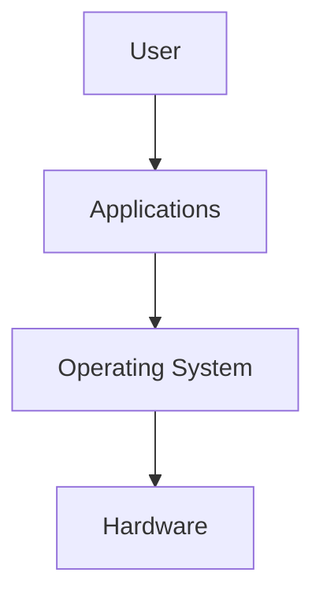

## OS Introduction

- An operating system (OS) is the core software that coordinates everything happening on a computer. 

## System Privilege Layers

1. Kernel space: Locked-down core of OS, kernel manages hardware,memory, CPU & processes. **Has unrestricted access to the system's hardware components, CPU, memory, storage,etc.
2. User space: All std applications run here, these are delibrately prevented from accessing hardware directly. When they want to perform any action, they must make a system call & the kernel does it on their behalf.

## OS Duties

1. Process Management - Creates, schedules, prioritizes & terminates processes. It decides how much time each process gets, makes multi-tasking easy. Ex: opening multiple apps without the laptop getting frozen.

2. Memory Management - Allocates RAM to processes, reclaims RAM when process ends, protects app's memory from processes, uses virtual memory to keep system stable when RAM is low.

3. File System Management - Organizes files, directories, handles naming, paths, file permissions, metadata.

4. User Management - Handles user accounts, authentication, permissions.

5. Device Management - Loads drivers & provides UI. Ex: plugging in new mouse,speakers or printers etc.

## OS Security

- OS, at a basic level handles:
   - Authentication: Verifies user through password or biometrics.
   - Isolation: Prevents processes from using app's memory.
   - Permissions: Controls what each user & app is allowed to r,w or e.
   - System Protection: Protects sytem from unauthorized changes.

## OS Interfaces

Interactions with OS are divided into 2 parts:
1. Graphical User Interface(GUI): The visual part of OS, icons,windows, that lets user interact by clicking or tapping on the screen.

2. Command-Line Interface(CLI): Text-based interface, where user enters commands to control system with precision & speed.

## Real World Operating Systems

1. Desktop

- Windows: The most widely used operating system on personal computers
Windows 10 (end-of-life), Windows 11
- macOS: Apple's desktop OS, known for its polished GUI and integration with other Apple devices
Sonoma (14), Sequoia (15), Tahoe (26)
- Linux: Not a single OS but a family of open-source operating systems called distributions
Ubuntu, Debian, Fedora

2. Server

- Windows: Used in large networks, data centers, and corporate environments
Server 2016, 2019, 2022, 2025
- Linux: The vast majority of web servers, trusted for its reliability and open-source nature
Ubuntu Server, Debian, CentOS, Red Hat
- Unix: Large enterprises, finance, telecom, government
IBM AIX, Oracle Solaris

3. Mobile

- Android: The most widely used mobile OS, which runs on phones, tablets, and smart devices
Android 14 - 16, Manufacturer versions
- iOS: Apple's mobile OS running on iPhones, iPads, and other devices
iOS 17, 18, 26

4. Embedded and IoT Devices

- Embedded Linux: Specialized OS built into devices with dedicated functions
OpenWrt, Ubuntu Core, Yocto Project
- Real-Time OS: Designed for apps where tasks need guaranteed response times (aircraft controls)
FreeRTOS, VxWorks, QNX

5. Virtual and Cloud

- Cloud/VM: Massive data centers that host websites, apps, and streaming services
Ubuntu LTS, Amazon Linux, Rocky Linux
- Container-optimized: Lightweight alternatives to VMs that package just the app and its dependencies
Alpine Linux, Bottlerocket AWS, Flatcar Linux
 

- Different devices have different requirements, so they need different operating systems. Each OS is designed for specific goals such as ease of use, security, performance, stability, or power efficiency.
 

## Windows Basics

- Early computers ran MS-DOS, which showed black screen where user typed commands instead of clicking icons.
- 1985: Miscrosoft launched Windows 1.0, a basic GUI built on top of DOS.
 

- Account types:
1. Guest: Restricted account for temporary access, doesn't have ability to change system settings.
2. Standard: A normal user account for performing everyday activities, can change system settings(personal), doesn't have access to system wide changes.
3. Administrator: Has complete access of the system, including software installation,user management & configuration.
 

Key Terminology:
   - Desktop: The main workspace where files, folders, and shortcuts live
   - Taskbar: A control strip that provides access to applications, tools, settings, and notifications.
   - Start Menu: The primary way to access applications, settings, and power options, signified by the Windows logo
   - Search: A quick access method of locating applications, settings, and files by entering search terms.
   - File Explorer: The built-in Windows tool to browse, manage, and organize files and folders.
   - Windows Update: A built-in update tool that helps keep your OS, native apps, and security features up to date.
   - Microsoft Store: The native Windows application for installing trusted applications.
   - Windows Settings: A centralized location for configuring system, device, personalization, and security settings.
   - Control Panel: The legacy management interface that provides access to system configuration options
   - Task Manager: A Windows tool for monitoring what is happening on your system in real time.

## Windows Security

- Windows Security is the central dashboard for managing Windows using built-in protection measures.
- Divided in 4 sections:
    1. Virus & threat protection: Detects malicious software using customizable scans & real-time protection.
    2. Firewall & Network protection: Monitors incoming & outgoing network traffic to help prevent unauthorized access.
    3. App & browser control: Protects user from accessing unsafe websites, files, apps,etc.
    4. Device Security: Protects the system by providing hardware based protection, making it secure.

 

- Windows Firewall is a built-in firewall, that monitors the network traffic using a set of predefined security rules tha tdetermine whether connections are allowed or denied.
- It operates on different profiles, allowing users to create customs rules or specify what it can access.
 

- Domain: When a system is connected to a organizations domain network.
- Private: Intended for trusted networks like home or lab environment.
- Public: Used for untrusted networks, such as public WiFi.

